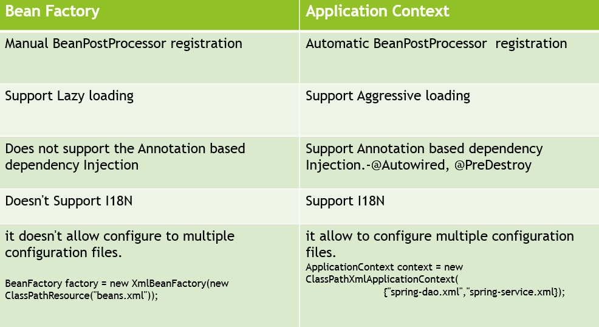
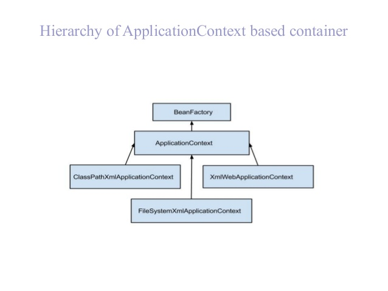

# Spring

`Business Layer` ----------------> `Data Layer`

`Business Logic To Do` -------> `Data Service Logic To Do`

    The Business Layer may need to call the Data Layer to retrieve some data therefore
    the Business Layer will be dependent on the Data Layer thus making the Data Layer 
    a 'DEPENDENCY' for the Business Layer. 
    WHY?
    Because the without the Data Layer the Business Layer will not function as expected.

  
### Component
  
      public @interface Component
      
      Indicates that an annotated class is a "component". 
      Such classes are considered as candidates for auto-detection 
      when using annotation-based configuration and classpath scanning.
      Other class-level annotations may be considered as identifying 
      a component as well, typically a special kind of component: e.g. 
      the @Repository annotation or AspectJ's @Aspect annotation.
      
### Autowired

    public @interface Autowired
    
    Marks a constructor, field, setter method or config method as to be 
    autowired by Spring's dependency injection facilities.
    Only one constructor (at max) of any given bean class may carry this 
    annotation, indicating the constructor to autowire when used as a 
    Spring bean. Such a constructor does not have to be public.
    
    Fields are injected right after construction of a bean, before 
    any config methods are invoked. Such a config field does not have 
    to be public.
    
    Config methods may have an arbitrary name and any number of arguments; 
    each of those arguments will be autowired with a matching bean in the 
    Spring container. Bean property setter methods are effectively just a 
    special case of such a general config method. Such config methods do 
    not have to be public.
    
    In the case of multiple argument methods, the 'required' parameter is 
    applicable for all arguments.
    
    In case of a Collection or Map dependency type, the container will 
    autowire all beans matching the declared value type. In case of a Map, 
    the keys must be declared as type String and will be resolved to 
    the corresponding bean names.
    
    Note that actual injection is performed through a BeanPostProcessor 
    which in turn means that you cannot use @Autowired to inject references 
    into BeanPostProcessor or BeanFactoryPostProcessor types. Please consult
     the javadoc for the AutowiredAnnotationBeanPostProcessor class 
     (which, by default, checks for the presence of this annotation).
  
### Component-Scan
    
    public @interface ComponentScan
    
    Configures component scanning directives for use with @Configuration classes. 
    Provides support parallel with Spring XML's <context:component-scan> element.
    Either basePackageClasses() or basePackages() (or its alias value()) may be 
    specified to define specific packages to scan. If specific packages are not 
    defined, scanning will occur from the package of the class that declares this 
    annotation.
    
    Note that the <context:component-scan> element has an annotation-config attribute; 
    however, this annotation does not. This is because in almost all cases when using 
    @ComponentScan, default annotation config processing (e.g. processing @Autowired 
    and friends) is assumed. Furthermore, when using AnnotationConfigApplicationContext, 
    annotation config processors are always registered, meaning that any attempt to 
    disable them at the @ComponentScan level would be ignored.
    
## Spring Core Container Modules

    - The main part of the Spring Framework is the core container.
    - The two most important parts within the Core container is the Application Context and the Bean Factory.
    - In the examples we were using the Application Context to launch up the Spring Beans. So all the beans were 
    running inside the Application Context we defined.
    - Instead of using the Application Context we could have used the BeanFactory. 
    - The BeanFactory is the main interface which provides handling of beans, the IOC features of Spring.
    - Application Context extends the BeanFactory and provides additional functionalities on top of it.
    
 
 
    - Application Context also supports integration of multiple configuration modules.
   
 

    Benefits of using the Application Context over the BeanFactory includes:
        - It provides really good integration for Aspect-Oriented-Programming. 
        - It provides really good integration with message resources. In typical web applications
        you would want Internationalization and Application Context has it built out of the box.
        - Application Context also has specific event handling. It provies listeners (e.g. request/response listeners)
        out of the box. 
        - Application Context can handle other contexts e.g. WebApplicationContext.
        
The Spring Documentation does advise us to use the Application Context over the BeanFactory [here.](https://docs.spring.io/spring/docs/current/spring-framework-reference/htmlsingle/#beans-introduction)
    
    
For more info check out:
*  [Core Container](https://docs.spring.io/spring/docs/current/spring-framework-reference/htmlsingle/#overview-core-container)